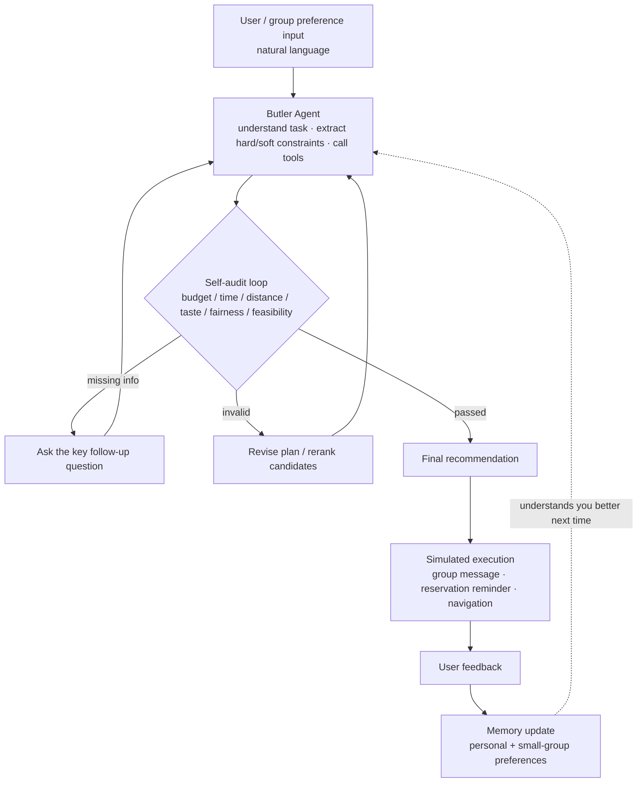

<!-- Hero image. GitHub renders it directly after the file lands in the repository. -->
<p align="center">
  
</p>

<p align="center">
  <a href="https://meituan-ai-hackathon.cn"></a>
  
  
</p>

<p align="center">
  <a href="README.md">中文 README</a> · <b>English</b>
</p>

<p align="center">
  
  
  
  
  
  <a href="skills/README.md"></a>
  
  
</p>

<p align="center"><b>Eleyao</b> is an OpenClaw-powered always-on local-life butler.<br/>It does more than answer "what should I eat today": it coordinates group preferences, audits constraints, revises plans, and then moves the decision forward.</p>

---

## How It Differs From a Generic AI Recommendation Bot

A common local-life assistant works like this: `user asks once -> model lists a few shops -> result is shown immediately`.

Eleyao adds two core capabilities:

| Innovation | Problem Solved | Approach |
| --- | --- | --- |
| **Self-audit loop** | The model may sound plausible while missing budget, dietary restrictions, distance, or execution risks | Before output, each plan is checked against budget, time, distance, taste, fairness, and feasibility. Invalid plans are revised or the butler asks a follow-up question. |
| **Group decision coordination** | Group dining usually has conflicting tastes, budgets, schedules, and distance constraints | The system extracts hard constraints and soft preferences for every participant, detects conflicts, generates trade-off options, and ranks by fairness instead of only average satisfaction. |

In one sentence: Eleyao turns a chat-style recommender into a local-life agent that understands people, detects conflicts, audits constraints, revises options, supports execution, and learns from feedback.

---

## System Architecture

<p align="center">
  
</p>

The system follows a **client -> API layer -> agent core -> capability layer** pipeline. A key security decision is that **all OpenClaw CLI / Gateway calls happen on the server side**. The mini program never stores tokens or model keys.

```text
WeChat Mini Program  --HTTPS-->  Next.js API Routes  --server-side-->  OpenClaw CLI / Gateway / LLM / self-built restaurant and POI dataset / Open-Meteo
      Food / Group Dining / Weekend Plan                         Self-audit + Memory
```

### OpenClaw Version and Skill Package

The online review environment uses **OpenClaw CLI / Gateway `2026.5.27 (27ae826)`** with the server-side profile `meituan01`, default agent `main`, default model `deepseek-v4-flash`, and a `128000` context window. The Gateway is loopback-only on the server: `127.0.0.1:19789 / [::1]:19789`. Tokens, AppSecret values, and model keys are never stored in this repository or in the mini program.

The three core strategies are packaged as project-level OpenClaw Skill deliverables under [`skills/README.md`](skills/README.md). See [`docs/openclaw-version-and-skills.md`](docs/openclaw-version-and-skills.md) for the full version note:

| Skill | Capability | Backend Flow |
| --- | --- | --- |
| [`eleyao-food-butler`](skills/eleyao-food-butler/SKILL.md) | Single-person food follow-up, restaurant recommendation, preference memory | `POST /api/food/recommend` |
| [`eleyao-group-dining`](skills/eleyao-group-dining/SKILL.md) | Group preference aggregation, conflict detection, fairness-aware recommendation | `POST /api/group-tasks/:taskId/recommend` |
| [`eleyao-weekend-planner`](skills/eleyao-weekend-planner/SKILL.md) | Weather, budget, time-window, and POI route planning | `POST /api/weekend/plans` |

Each skill includes `SKILL.md`, metadata, a prompt template, input/output schemas, and request/response examples. After cloning this repository, install the package into an OpenClaw skills root with:

```bash
node skills/install-eleyao-skills.mjs --target ~/.openclaw/skills --force
```

### Agent Decision Pipeline

This Mermaid diagram renders natively on GitHub and shows the core generate-audit-revise-execute loop:



---

## Mini Program Screenshots

> Full interactive demo: **[meituan-ai-hackathon.cn](https://meituan-ai-hackathon.cn)**

<table>
<tr>
<td width="25%" valign="top">

<h3 align="center">1. Home</h3>
<p>Single-person recommendation, group dining, nearby planning, and preference memory are collected into one mini program entry.</p>
</td>
<td width="25%" valign="top">

<h3 align="center">2. What to Eat Today</h3>
<p>Preference Q&A -> OpenClaw cloud recommendation -> local preference memory. If the remote gateway is unavailable, the flow automatically falls back to the local fallback dataset and rule-based safeguards.</p>
</td>
<td width="25%" valign="top">

<h3 align="center">3. Group Dining</h3>
<p>Create a task (server stores only <code>sha256(inviteToken)</code>) -> members submit preferences -> conflicts are detected -> candidates are generated -> plans are audited -> recommendation and invite copy are produced.</p>
</td>
<td width="25%" valign="top">

<h3 align="center">4. Nearby Planning</h3>
<p>Combines Open-Meteo weather, a self-built POI/activity dataset, and the AI context pipeline to generate three routes with timelines, budgets, self-checks, risk notes, and conservative fallback when weather fails.</p>
</td>
</tr>
</table>

---

## Core Technical Ideas

### 1. Self-audit Loop: Rules + LLM-as-a-Judge

Hard indicators are checked with deterministic rules, while soft preference reasoning and explanations use LLM assistance. This avoids plans that only "sound right".

| Check | Type | Description |
| --- | --- | --- |
| Budget | Rule | Whether the plan exceeds global or member-level budget limits |
| Time | Rule | Whether end time, opening hours, and travel time are feasible |
| Distance | Rule | Whether the route is too far or unrealistic |
| Dietary restrictions | Rule | Whether spicy food, allergies, or other hard restrictions are violated |
| Fairness | Score | Whether one participant is obviously sacrificed |
| Feasibility | Rule + LLM | Queue risk, closing risk, and route realism |

The audit result drives the agent's next move: missing information triggers a follow-up question; over-budget plans are reranked; dietary violations are rejected; low fairness triggers another pass.

### 2. Group Coordination: Hard Constraints, Soft Preferences, and Fairness

- **Hard constraints** must not be violated: allergies, no-spicy, budget caps, leaving before a fixed time.
- **Soft preferences** should be satisfied when possible: spicy food, photo-friendly places, quiet environment.
- **Fairness scoring** considers both average satisfaction and the minimum individual satisfaction:

```text
total score = average satisfaction * 0.7 + minimum personal satisfaction * 0.3
// Any hard-constraint violation rejects the plan.
```

This prevents a fake "best" answer where two people are satisfied and one person cannot accept the plan at all.

### 3. Safety Boundaries

- OpenClaw CLI path, Gateway URL / token, and model keys are only configured as backend environment variables.
- Group invite links store only `sha256(inviteToken)` on the server. Reading, submitting, and generating recommendations all require the invite token.

---

## Tech Stack

| Layer | Technology |
| --- | --- |
| Client | Native WeChat Mini Program |
| API / Backend | Next.js App Router, API Routes, TypeScript |
| Agent Capability | OpenClaw CLI / Gateway, LLM, LLM-as-a-Judge |
| External Data | Open-Meteo weather, self-built structured restaurant/POI dataset |
| Storage | Runtime JSON files, replaceable with SQLite / KV / Postgres |
| Data Analysis | Python survey processing and visualization in `analysis/` |

---

## Quick Start

> See [`frontend/README.md`](frontend/README.md) and [`mini-program/wechat-miniprogram/README.md`](mini-program/wechat-miniprogram/README.md) for detailed setup.

**Backend (Next.js)**

```bash
cd frontend
npm install
# OpenClaw integration. All three core modules use backend AI / OpenClaw / AI-context pipelines.
export OPENCLAW_CLI_PATH="/path/to/openclaw"
export OPENCLAW_PROFILE="meituan01"
export OPENCLAW_GATEWAY_URL="ws://127.0.0.1:19789"
export OPENCLAW_GATEWAY_TOKEN="your-gateway-token"
npm run dev   # http://localhost:3000
```

**Mini Program**

1. Import `mini-program/wechat-miniprogram` in WeChat DevTools.
2. In `app.js`, set `globalData.authApiBaseUrl`, `foodRecommendApiBaseUrl`, `groupDiningApiBaseUrl`, and `weekendApiBaseUrl` to the same HTTPS backend origin. For local debugging, the storage key `MINIPROGRAM_API_BASE_URL` can override the backend origin temporarily.

---

## Repository Layout

```text
meituan-ai-hackathon-eleyao-butler/
├─ frontend/                 # Next.js backend + H5: API routes, agent proxy, self-built data layer, fallback
│  ├─ app/api/               # food / group-tasks / weekend / user ...
│  └─ lib/                   # self-built data, recommendation rules, OpenClaw proxy, and fallback logic
├─ mini-program/             # WeChat Mini Program MVP frontend
│  └─ wechat-miniprogram/    # pages and services for food/group/weekend/memory
├─ analysis/                 # Survey data analysis: Python, charts, metrics
├─ data/                     # Raw survey data
├─ skills/                   # OpenClaw Skill package: food / group dining / nearby planning
└─ docs/                     # Requirements, design discussions, deployment runbooks
```

---

## Team and Track

- **Track**: Meituan AI Hackathon, Problem 01, an OpenClaw-powered always-on local-life butler
- **Live submission**: [meituan-ai-hackathon.cn](https://meituan-ai-hackathon.cn)
- **Contribution guide**: see [`CONTRIBUTING.md`](CONTRIBUTING.md). Every PR should reference its issue with `Closes #xx`.

<p align="center"><sub>Understand people · audit constraints · revise plans · move decisions forward · keep learning</sub></p>
