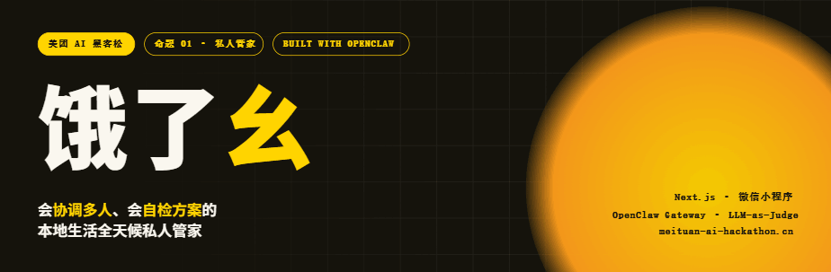
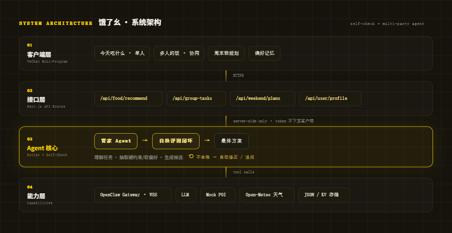
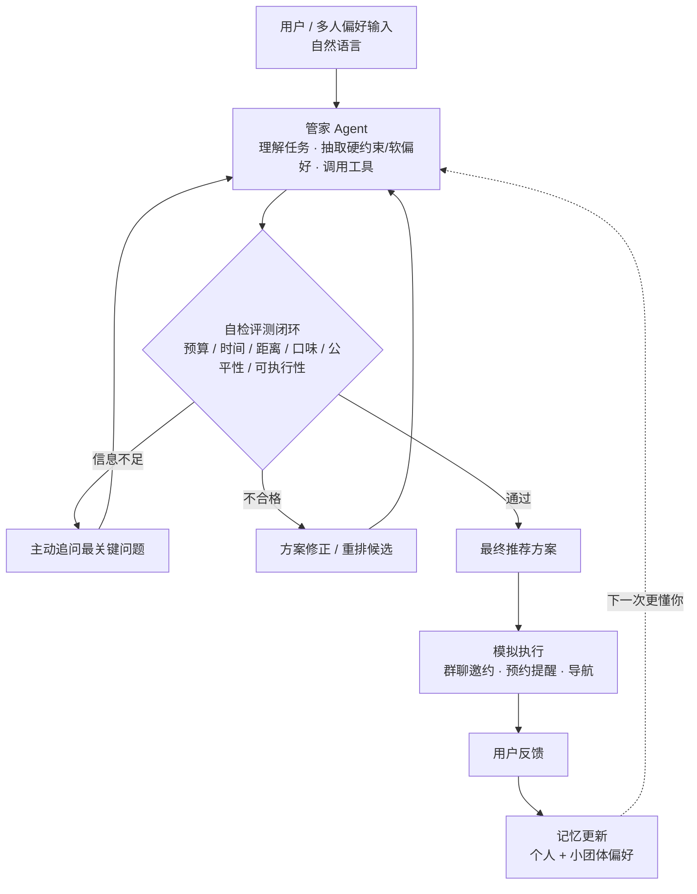
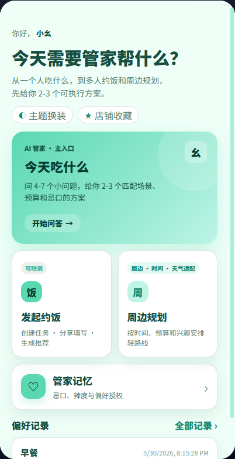
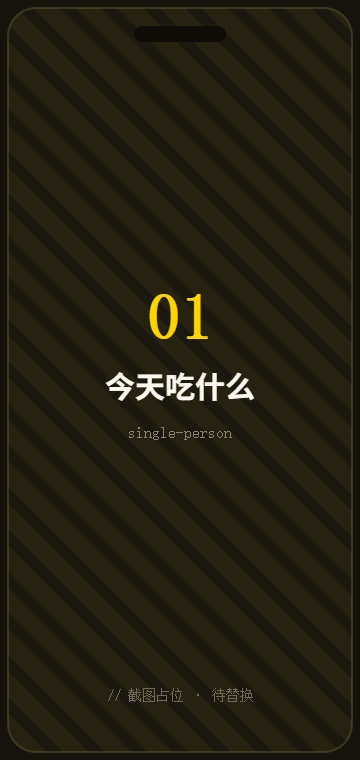
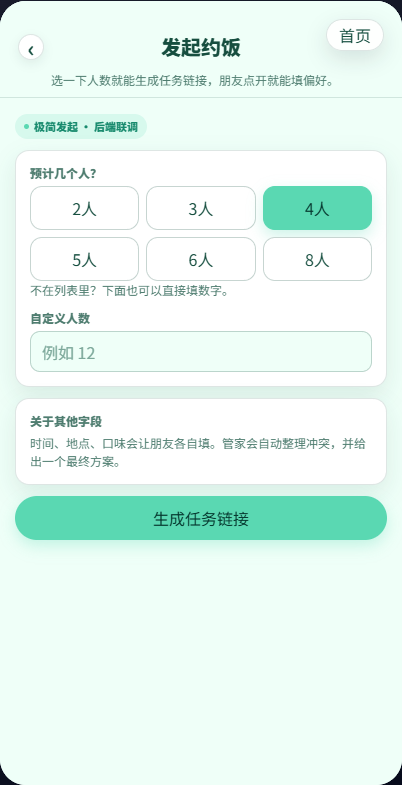
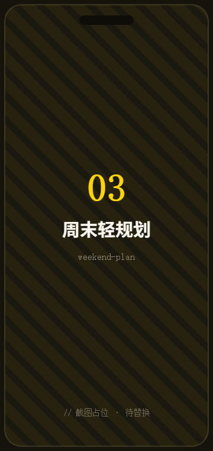

<!-- 顶部主视觉，放进仓库后 GitHub 会自动渲染 -->
<p align="center">
  
</p>

<p align="center">
  <a href="https://meituan-ai-hackathon.cn"></a>
  
  
</p>

<p align="center">
  
  
  
  
  
  
</p>

<p align="center"><b>饿了幺</b> 是一个基于 OpenClaw 的本地生活「全天候私人管家」。<br/>它不只是回答"今天吃什么"，更会<b>协调多人偏好</b>、<b>自检方案约束</b>、<b>修正后再执行</b>。</p>

---

## ✦ 它和普通"AI 推荐助手"有什么不一样

普通本地生活助手是：`用户问一句 → 模型生成几家店 → 直接输出`。

饿了幺多做了两件事，也是我们的两个核心创新：

| 创新 | 解决的问题 | 做法 |
| --- | --- | --- |
| 🛡️ **自检评测闭环** | 模型"说得像真的"，却忘预算、忘忌口、路线不现实 | 方案输出前先过预算 / 时间 / 距离 / 口味 / 公平性 / 可执行性审计，不合格自动修正或追问 |
| 🤝 **多人协同决策** | 几个人约饭，口味、预算、时间、距离互相冲突 | 抽取每个人的硬约束与软偏好，识别冲突，生成多个折中方案，用公平性指标择优 |

> 一句话：把作品从"会聊天的推荐助手"升级成 **会理解多人、识别冲突、审计约束、修正方案、推进执行、持续学习的本地生活 Agent。**

---

## ✦ 系统架构

<p align="center">
  
</p>

整体是一条 **客户端 → 接口层 → Agent 核心 → 能力层** 的链路。关键设计：**所有 OpenClaw CLI / Gateway 调用只发生在服务端**，小程序永远不持有任何 token 或模型 key。

```text
微信小程序  ──HTTPS──▶  Next.js API Routes  ──server-side──▶  OpenClaw CLI / Gateway / LLM / Mock POI / Open-Meteo
   今天吃什么 / 多人约饭 / 周末规划            自检评测 + 记忆
```

### Agent 决策管线

下面这张图在 GitHub 上会原生渲染（mermaid），是我们"生成—自检—修正—执行"闭环的核心：



---

## ✦ 小程序真实截图

> 完整可交互演示见线上 Demo 👉 **[meituan-ai-hackathon.cn](https://meituan-ai-hackathon.cn)**

<table>
<tr>
<td width="25%" valign="top">

<h3 align="center">① 首页入口</h3>
<p>把单人推荐、多人约饭、周边规划和偏好记忆收束到同一个小程序入口。</p>
</td>
<td width="25%" valign="top">

<h3 align="center">② 今天吃什么</h3>
<p>问答收集偏好 → OpenClaw 云端推荐 → 本地偏好记忆。远端不可用时<b>自动降级</b>到本地 mock 推荐，流程不中断。</p>
</td>
<td width="25%" valign="top">

<h3 align="center">③ 多人约饭</h3>
<p>发起任务（服务端只存 <code>sha256(inviteToken)</code>）→ 成员填偏好 → 识别冲突 → 生成候选 → 自检 → 推荐 + 一键邀约。</p>
</td>
<td width="25%" valign="top">

<h3 align="center">④ 周边规划</h3>
<p>结合 Open-Meteo 实时天气 + Mock POI，生成 3 条带时间线 / 预算 / 自检 / 风险提示的路线，天气失败也有保守兜底。</p>
</td>
</tr>
</table>

---

## ✦ 核心技术原理

### 1. 自检评测闭环（规则 + LLM-as-a-Judge）

硬指标走规则、软偏好与解释走 LLM，两者结合避免"模型自说自话"：

| 检查项 | 类型 | 说明 |
| --- | --- | --- |
| 预算检查 | 规则 | 是否超过总体 / 成员预算上限 |
| 时间检查 | 规则 | 结束时间、营业时间、路程时间是否满足 |
| 距离检查 | 规则 | 是否过远 / 绕路 |
| 口味禁忌 | 规则 | 是否违反不吃辣、过敏等硬约束 |
| 公平性 | 评分 | 是否明显牺牲某一个成员 |
| 可执行性 | 规则 + LLM | 排队风险、关门风险、路线是否现实 |

自检结果会直接驱动 Agent 的下一步动作：信息不足→追问；超预算→重筛；违反忌口→淘汰；满意度过低→重排。

### 2. 多人协同：硬约束 / 软偏好 + 公平性评分

- **硬约束**（不可违反）：过敏、不吃辣、预算上限、几点前离开 → 违反则方案直接降级或淘汰。
- **软偏好**（尽量满足）：想吃辣、想拍照、想安静 → 用于排序与解释。
- **公平性评分**，不只看平均、也保最低个人满意度：

```text
方案总分 = 平均满意度 × 0.7 + 最低个人满意度 × 0.3
// 任一成员硬约束被违反 → 该方案直接淘汰
```

这样可以避免"两人很满意、一人完全无法接受"的伪最优方案。

### 3. 安全边界

- OpenClaw CLI 路径、Gateway URL / token、模型 key **只在后端环境变量**，绝不写入小程序。
- 多人任务邀请链接：服务端只保存 `sha256(inviteToken)`，读取 / 提交 / 生成推荐都需带 token。

---

## ✦ 技术栈

| 层 | 技术 |
| --- | --- |
| 客户端 | 微信小程序（原生） |
| 接口 / 后端 | Next.js（App Router · API Routes · TypeScript） |
| Agent 能力 | OpenClaw CLI / Gateway · LLM · LLM-as-a-Judge |
| 外部数据 | Open-Meteo 天气 · 结构化 Mock POI |
| 存储 | 运行时 JSON 文件（可平滑替换 SQLite / KV / Postgres） |
| 数据分析 | Python（问卷处理与可视化，见 `analysis/`） |

---

## ✦ 快速开始

> 详细配置见 [`frontend/README.md`](frontend/README.md) 与 [`mini-program/wechat-miniprogram/README.md`](mini-program/wechat-miniprogram/README.md)。

**后端（Next.js）**

```bash
cd frontend
npm install
# 接入 OpenClaw（单人"今天吃什么"必需，多人/周末可先用 mock）
export OPENCLAW_CLI_PATH="/path/to/openclaw"
export OPENCLAW_PROFILE="meituan01"
export OPENCLAW_GATEWAY_URL="ws://127.0.0.1:19789"
export OPENCLAW_GATEWAY_TOKEN="your-gateway-token"
npm run dev   # http://localhost:3000
```

**小程序**

1. 用微信开发者工具导入 `mini-program/wechat-miniprogram`。
2. 在 `app.js` 的 `globalData.authApiBaseUrl` / `foodRecommendApiBaseUrl` / `groupDiningApiBaseUrl` / `weekendApiBaseUrl` 填同一个 HTTPS 后端域名；开发调试也可用 storage key `MINIPROGRAM_API_BASE_URL` 临时覆盖。

---

## ✦ 目录结构

```text
meituan_prj/
├─ frontend/                 # Next.js 后端 + H5（API routes / Agent 代理 / mock）
│  ├─ app/api/               # food / group-tasks / weekend / user ...
│  └─ lib/                   # mockData · mockFunctions（规则版 mock Agent）
├─ mini-program/             # 微信小程序前端 MVP
│  └─ wechat-miniprogram/    # pages（food/group/weekend/memory）· services（各场景 adapter）
├─ analysis/                 # 问卷数据分析（Python · 图表 · 指标）
├─ data/                     # 原始问卷数据
└─ docs/                     # 需求文档 · 选题讨论 · 部署 runbook
```

---

## ✦ 团队 & 赛道

- **赛道**：美团 AI 黑客松 · 命题 01 —— 基于 OpenClaw 的本地生活「全天候私人管家」
- **线上提交**：[meituan-ai-hackathon.cn](https://meituan-ai-hackathon.cn)
- **贡献规范**：见 [`CONTRIBUTING.md`](CONTRIBUTING.md)（每个 PR 需用 `Closes #xx` 关联 issue）

<p align="center"><sub> 理解多人 · 自检约束 · 修正方案 · 推进执行 · 持续学习</sub></p>
