# AI 管家问卷分析报告：按年龄段分组

> 本报告由 `analysis/scripts/analyze_survey.py` 自动生成。总体和年龄段主分析使用全样本；只有“在校/已工作”对比使用临时派生字段。

## 1. 数据说明与质量概览

- 样本量：`104` 条，原始字段 `202` 列；Credamo 双表头已自动识别，实际数据从第三行开始。
- 统计口径：总体和年龄段图表使用全样本 `104`；涉及“在校/已工作”的图表和结论才使用 `school_work_status` 派生字段。
- 在校/已工作派生口径：可分样本 `86` 人，其中在校 `33` 人、已工作 `53` 人；边界模糊 `18` 人不进入该分组统计分母。
- 年龄结构：30 岁以上 32 人（30.8%）；18-22 岁 29 人（27.9%）；23-26 岁 26 人（25.0%）；27-30 岁 17 人（16.3%）。
- 作答时长：中位数 `347` 秒，均值 `384` 秒，范围 `113-1223` 秒。
- 注意力题：`满意` 为 `104` 人（100.0%），当前批次按高质量真实样本处理。
- 质检结果仅做透明展示，不作为当前批次剔除规则。

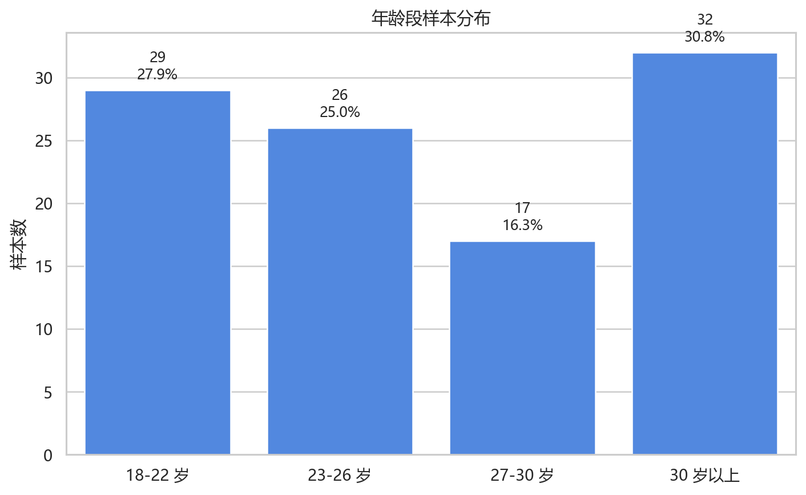

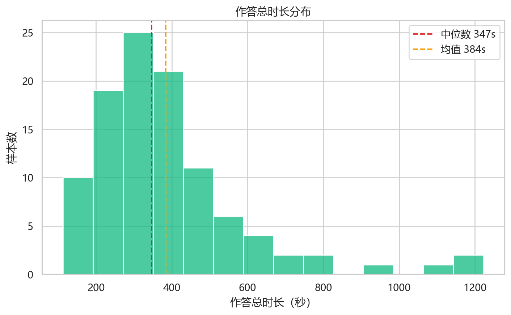

## 2. 年龄段用户画像

这批样本的用户基础很适合验证“本地生活 AI 管家”：AI 使用频率和本地生活 App 使用频率都较高，说明他们既有 AI 心智，也有高频本地生活决策场景。

- AI 使用：每天日常使用,主要用来聊天、查资料、问问题 51 人（49.0%）；每天高强度使用,工作/学习深度依赖 AI(比如用 AI 写代码、写文档、做研究) 33 人（31.7%）；每周使用几次，有需要时才用 19 人（18.3%）。
- 本地生活 App 使用：几乎每天使用 59 人（56.7%）；每周 3-5 次 33 人（31.7%）；每周 1-2 次 10 人（9.6%）。
- 对 AI 管家的第一反应：愿意主动尝试或看到后试试共 `84` 人（80.8%）。

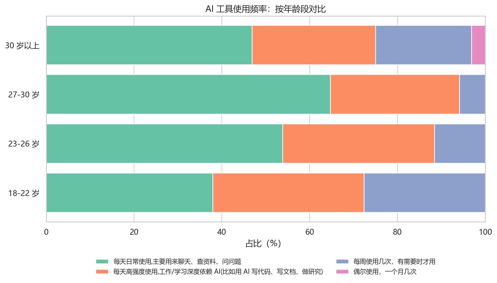

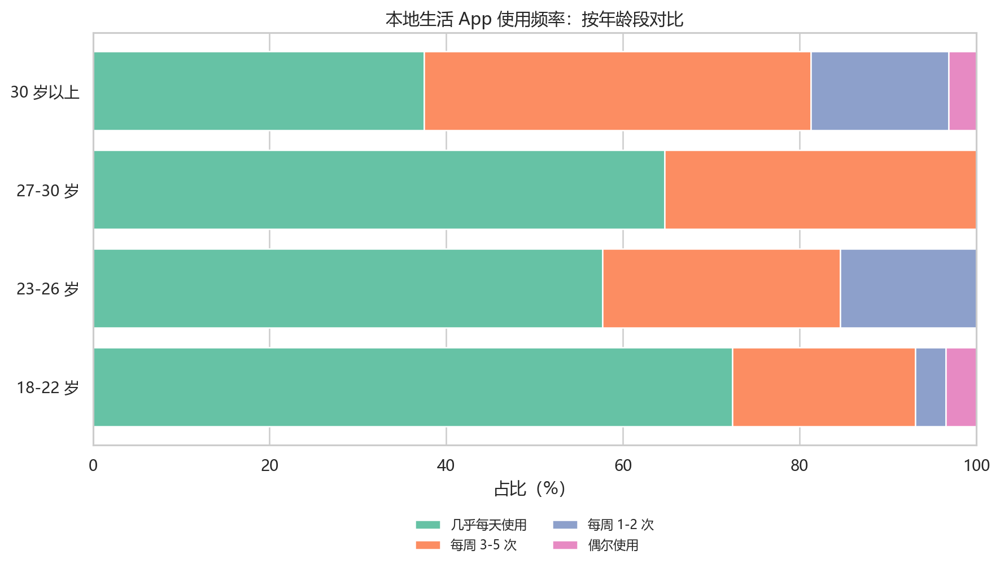

## 3. 本地生活决策痛点

痛点不是“没有信息”，而是信息太多、跨平台比较成本高、真假评价难辨，并且具体到吃饭/约饭场景时会变成选择和协调负担。

- 最容易纠结的场景：一个人吃什么/点什么外卖 40 人（38.5%）；和朋友约饭 / 聚会地点 26 人（25.0%）；周末去哪玩 / citywalk / 看展 16 人（15.4%）；怎么安排本地路线 / 活动顺序 15 人（14.4%）。
- 决策状态：偶尔纠结，但通常能较快决定 53 人（51.0%）；需要比较多个 App 或问朋友后才能决定 34 人（32.7%）；通常懒得做决定，希望有人直接给方案 6 人（5.8%）；经常拖很久也决定不了 4 人（3.8%）。
- 多选痛点 Top 3：餐厅 / 活动评价真假难辨 64 人（61.5%）; 信息太多，不知道怎么选 62 人（59.6%）; 需要在多个 App 之间反复切换 52 人（50.0%）。

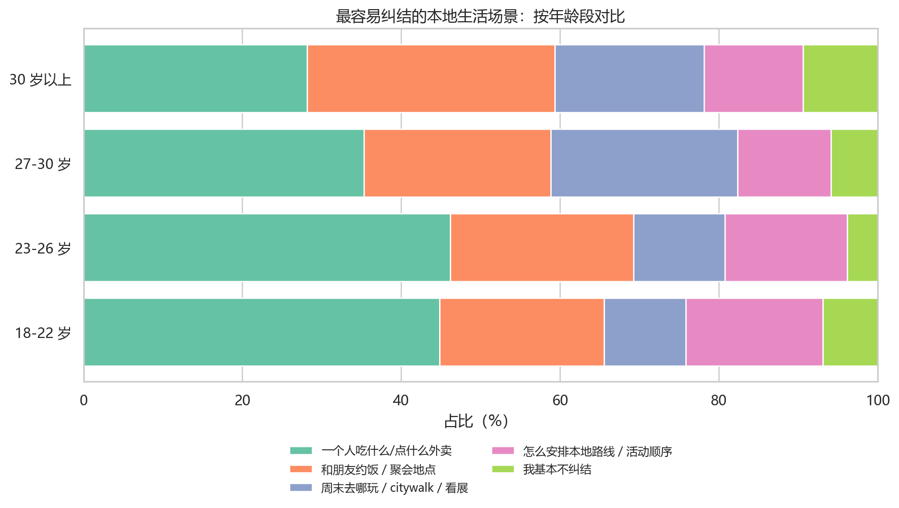

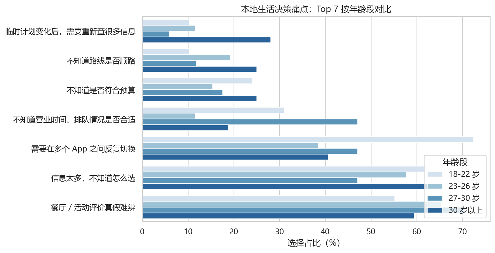

## 4. 多人约饭为什么值得做主场景

多人约饭符合高频、痛点明确、适合展示管家能力三个条件：它不仅需要推荐，还需要收集偏好、识别冲突、解释折中。

- 遇到“经常/有时”约饭难定：`80` 人（76.9%）。
- 约饭分歧时愿意尝试 AI 生成折中方案：`68` 人（65.4%）。
- 希望 AI 说明“照顾了谁的偏好、牺牲了什么”：`83` 人（79.8%）。
- 常见冲突 Top 3：口味不同 63 人（60.6%）; 时间不一致 44 人（42.3%）; 距离远近不同 44 人（42.3%）。

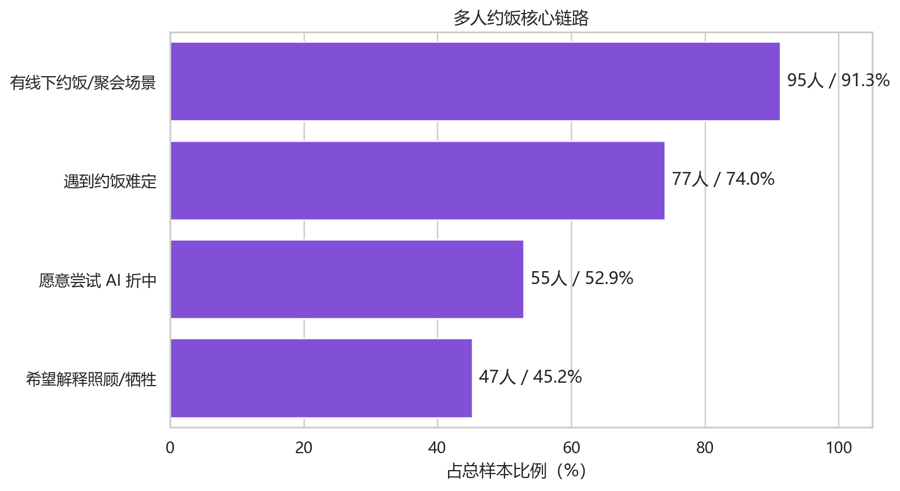

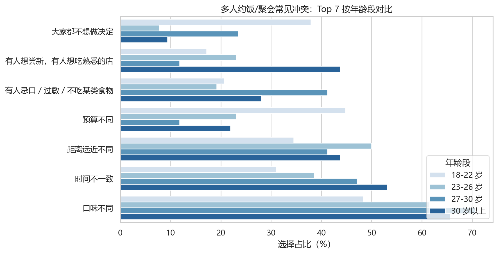

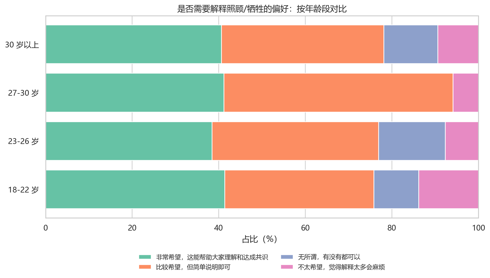

## 5. AI 管家的接受度与主动边界

用户并不排斥主动性，但边界很明确：更偏好“合适时间出现、不要太频繁”，而不是无条件打扰。

- 接受主动提醒或两者都可但不频繁：`87` 人（83.7%）。
- 用户最希望 AI 做的事 Top 3：根据预算、口味、距离、评分等推荐餐厅 58 人（55.8%）; 想不到吃什么/玩什么时，帮我找灵感 55 人（52.9%）; 帮我规划周末活动 / 短途游 / citywalk 50 人（48.1%）。
- 场景排序显示，“一个人吃什么”和“多人约饭/聚会”是最靠前的两个场景。

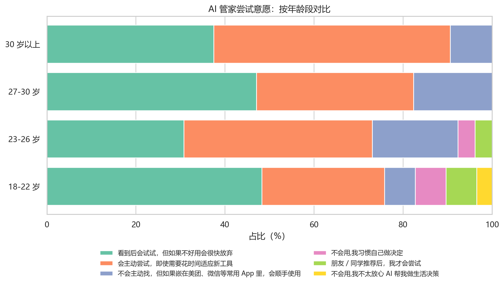

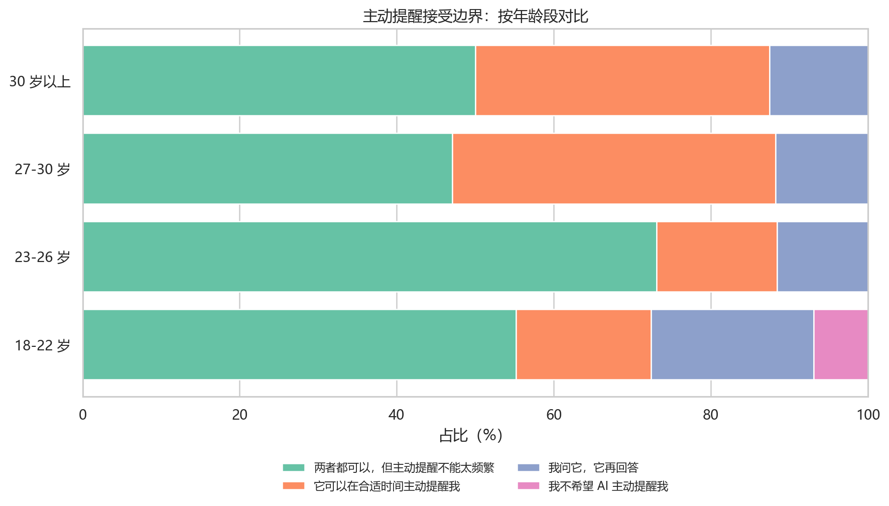

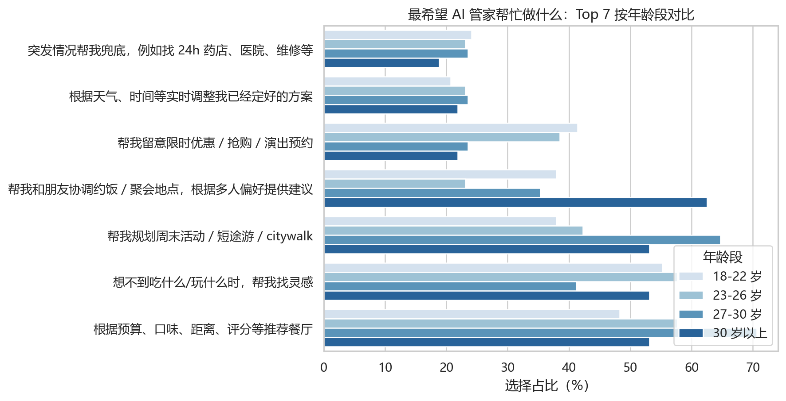

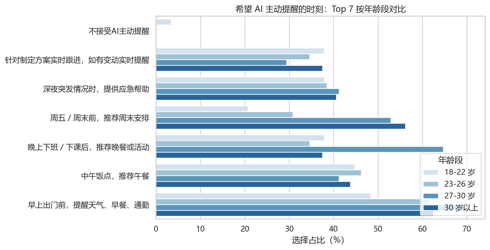

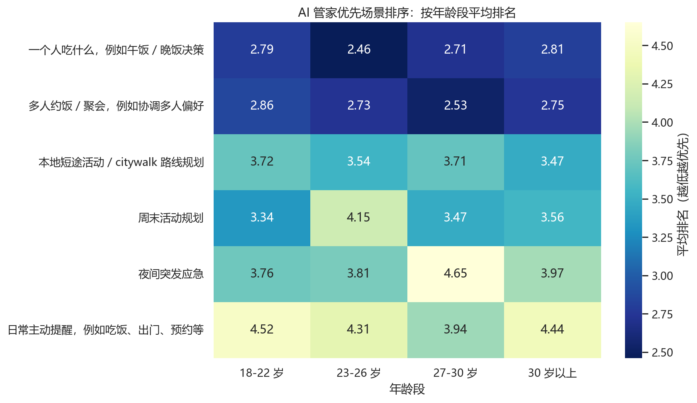

## 6. 方案自检与信任机制

“靠谱”比“会说”更重要。用户在意 AI 是否能在推荐前检查关键约束，尤其是预算、排队、营业和多人需求是否被明显牺牲。

- 最看重的自检项：是否有人的需求被明显牺牲 29 人（27.9%）; 是否超预算 29 人（27.9%）; 是否排队太久 24 人（23.1%）。
- 如果方案不满足条件，用户更倾向于 AI 自动重新生成、直接说明问题或主动追问缺失信息。

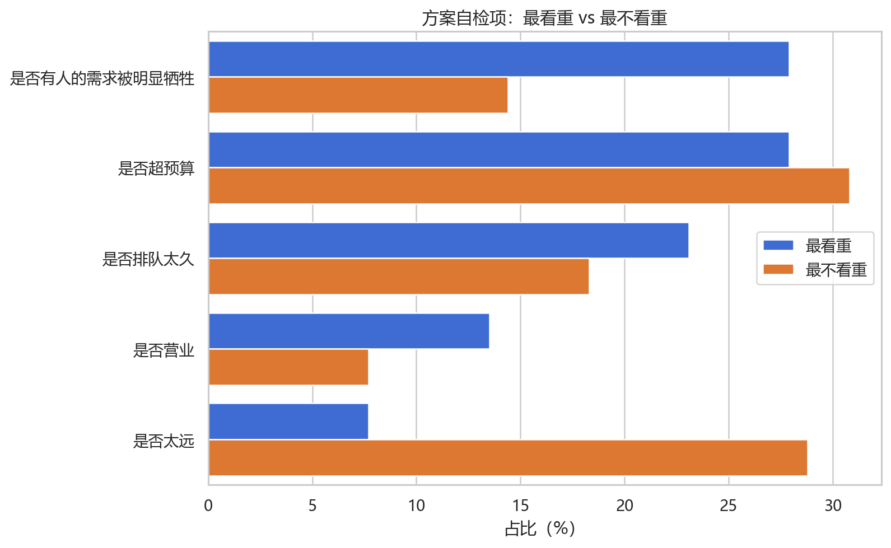

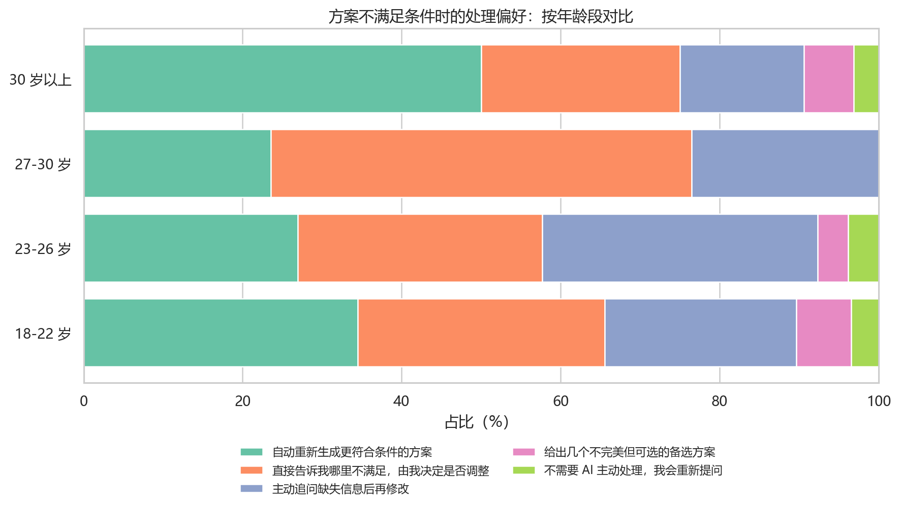

## 7. 记忆偏好与隐私边界

记忆能力有价值，但必须给用户控制权。用户最能接受的是记录口味、忌口、预算、常见场景等对决策有直接帮助的信息。

- 非常/比较希望 AI 记住个人长期偏好：`93` 人（89.4%）。
- 朋友/小团体偏好记录方式：可以记录我和朋友 / 同事的偏好，只要能提高决策效率 36 人（34.6%）；可以记录，但需要每个人自己填写或确认后才能使用 33 人（31.7%）；可以记录，但我希望能随时查看、修改或删除 33 人（31.7%）。
- 主要顾虑 Top 3：隐私泄露 65 人（62.5%）; 推荐不准确 48 人（46.2%）; 推荐商家不客观 46 人（44.2%）。

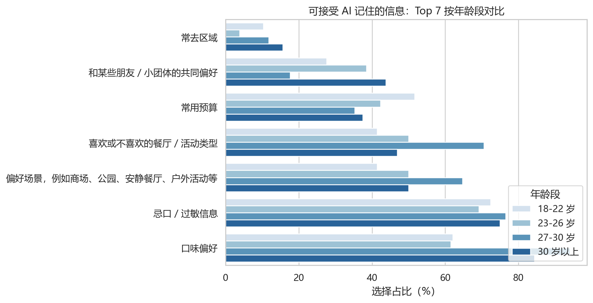

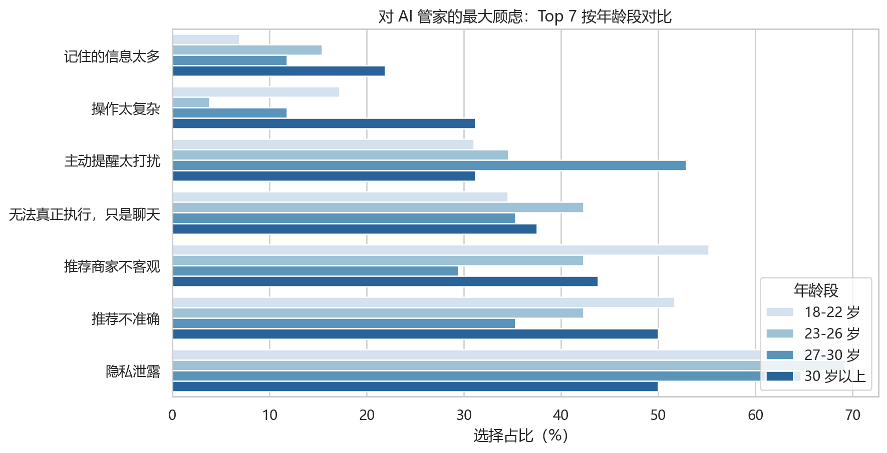

## 8. 产品建议：主 Demo 应如何讲

1. 主 Demo 聚焦“多人约饭”，不要泛泛展示所有本地生活场景。
2. 输出方式建议是 `2-3 个方案 + 冲突识别 + 推荐理由 + 风险提示`，而不是直接给一个单点推荐。
3. 管家角色应该“主动但克制”：在饭点、周末前、方案变动时出现，但必须避免高频打扰。
4. 方案自检要显性展示：预算、距离、排队、营业、忌口/偏好牺牲都应成为推荐前检查项。
5. 记忆功能要有可查看、可修改、可删除的入口，特别是涉及朋友/小团体偏好时。

## 开放题主题

开放题共 `87` 条有效文本。主题编码是规则辅助分类，可多标签，用于发现叙事素材而非严格统计推断。

不知道吃什么/选店困难 52 次; 多人约饭/意见冲突 46 次; 路线/距离/时间安排 42 次; 信息过载/多 App 切换 23 次; 未填写 17 次。

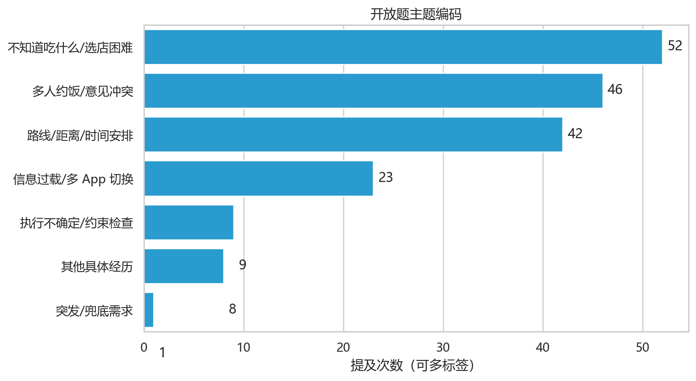

## 附录：第一题处理说明

“你的身份是？”这一题存在不可逆歧义：选项同时包含专科、本科生、研究生、博士生和已工作年限，部分被试可能按学历理解，部分按当前身份理解。因此本报告主分析不使用该题做核心分组，只在这里保留交叉分布供查阅。

身份/学历题按年龄段交叉表已输出到 `outputs/2026-05-08/tables/appendix_identity_ambiguous_by_age.csv`。

如后续需要比较“在校/已工作”，使用 `school_work_status` 临时派生口径：`18-22 岁 + 专科/本科生`、`23-26 岁 + 研究生/博士生`、`27-30 岁 + 博士生` 归为在校；明确已工作选项，以及 `27-30 岁/30 岁以上 + 专科/本科生/研究生` 归为已工作；`23-26 岁 + 专科/本科生` 和 `30 岁以上 + 博士生` 归为边界模糊并剔除出该分组统计。该规则只用于当前问卷歧义数据，后续新版问卷拆分“当前状态”和“最高学历/教育阶段”后应废弃。

在校/已工作派生统计已输出到 `outputs/2026-05-08/tables/school_work_status_summary.csv`；按年龄与身份/学历题的审计明细已输出到 `outputs/2026-05-08/tables/school_work_status_by_age_identity.csv`。
